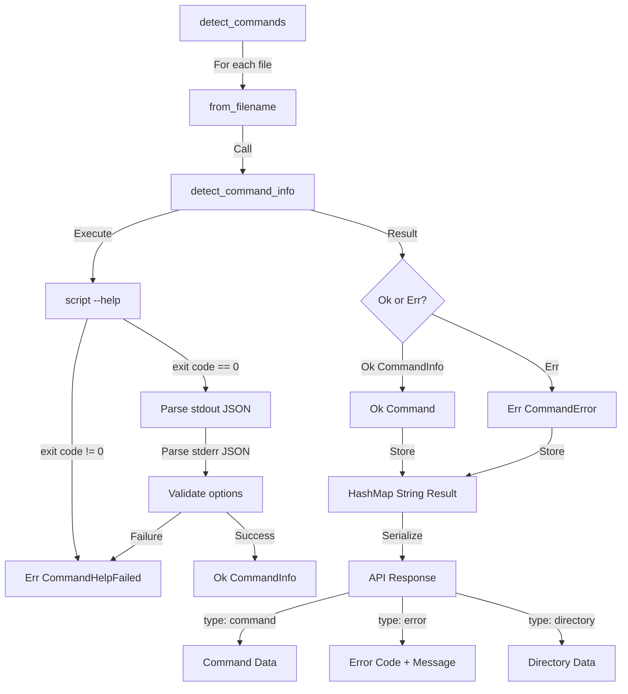

# Remove YAML Support and Add --help/--state Flag Support

## Overview

Remove the `.yaml`/`.yml` file-based script metadata system and replace it with dynamic script introspection using `--help` and `--state` flags. Scripts that fail validation will be kept in the command tree as `Err(CommandError)` for UI display with error information. The command tree structure changes from `HashMap<String, Command>` to `HashMap<String, Result<Command, CommandError>>` to support error handling.

## Files to Modify

### 1. [src/cmd/errors.rs](src/cmd/errors.rs)

- Add `error_code() -> i32` method to `CommandError` enum returning codes in 3000s range
- Add new error variant for `--help` failures:
  ```rust
  CommandHelpFailed {
      command: PathBuf,
      exit_code: i32,
      stdout: String,
      stderr: String,
  }
  ```
- Update error messages to include `name`, `file_path`, and `http_path` context (e.g., "could not load command {name} from {file_path} (http path: {http_path}) because ...")
- Remove or deprecate YAML-related error variants: `DecodeCommandInfo`, `ReadCommandInfoFile`, `CommandInfoFileNotIsNotFile`
- Remove `serde_yaml` import if no longer needed

### 2. [src/cmd/tree.rs](src/cmd/tree.rs)

**Command struct changes:**
- Change `commands: HashMap<String, Command>` to `commands: HashMap<String, Result<Command, CommandError>>`
- Implement custom `Serialize` for `Result<Command, CommandError>`:
  - `Ok(Command)` with `is_directory=false` → `{"type": "command", "name": "...", "http_path": "...", "info": {...}, ...}`
  - `Ok(Command)` with `is_directory=true` → `{"type": "directory", "name": "...", "http_path": "...", "commands": {...}, ...}`
  - `Err(CommandError)` → `{"type": "error", "code": 3001, "message": "error message with context"}`
- Remove `#[serde(skip)]` annotations if needed for error serialization

**CommandInfo struct changes:**
- Add `title: Option<String>` field (for short description from `--help` JSON)
- Remove `state: Option<CommandInfoGetState>` field (no longer needed)
- Keep `support_state: bool` (set from `--help` JSON `state` field)
- Update serialization if needed

**Remove CommandInfoGetState enum:**
- Delete the entire enum definition (lines 81-86)

**detect_command_info function (lines 232-340):**
- Remove all YAML file reading logic (lines 233-279)
- Implement new logic:
  1. Execute script with `--help` flag: `runner::run_command(&command_filename, vec!["--help".to_string()], None, false, HashMap::new())`
  2. Check exit code - if non-zero, return `Err(CommandError::CommandHelpFailed { command: command_filename.clone(), exit_code, stdout, stderr })`
  3. Parse JSON from stdout: `{title?: string, description?: string, version?: string, state?: boolean}`
  4. Parse JSON from stderr (pure JSON, no log line filtering) for options definition matching current YAML structure: `HashMap<String, CommandOptionInfo>`
  5. Apply defaults: empty string for missing description/title, `None` for version, `false` for state
  6. Validate options JSON structure matches expected format
  7. Return `Result<CommandInfo, CommandError>`

**detect_commands function (lines 99-175):**
- Change return type to `Result<HashMap<String, Result<Command, CommandError>>, CommandError>`
- Remove YAML file filtering logic (lines 130-134: check for `.yaml`/`.yml` extension)
- Update to handle `Result` values in hashmap

**from_filename function (lines 203-230):**
- Change return type to `Result<(String, Result<Command, CommandError>), CommandError>`
- Handle `detect_command_info` returning `Err`:
  - Create minimal `Command` with `name`, `file_path`, `http_path`, `is_directory=false`, `info: None`, `commands: HashMap::new()`
  - Return `Ok((name, Err(error)))` instead of propagating error
- Store `Result` in hashmap instead of unwrapping

**reload function (lines 89-97):**
- May need minor updates if function signatures change

### 3. [src/cmd/mod.rs](src/cmd/mod.rs)

**search_for_command function (lines 15-51):**
- Update to handle `HashMap<String, Result<Command, CommandError>>`
- When accessing `command.commands.get(...)`, handle the `Result`:
  - If `Ok(Command)`, continue traversal
  - If `Err(CommandError)`, keep it as `Err` but continue searching (don't fail entire search)
- Only return error if final target command is `Err`
- Update function signature if needed

**get_state function (lines 66-94):**
- Remove `CommandInfoGetState` enum matching logic (lines 70-83)
- Simplify to:
  1. Check `info.support_state == true`, return error if false
  2. Call script with `--state` flag: `runner::run_command(&command.file_path, vec!["--state".to_string()], None, true, env_map)`
  3. Parse stderr for log lines (INFO/ERROR/DEBUG/WARNING/TRACE/REPORT prefixes)
  4. Parse stdout: if valid JSON return parsed `serde_json::Value`, else if exit code is 0 return as JSON string
  5. Handle errors appropriately
- Remove `CommandInfoGetState` import

**check_input function:**
- Should work as-is, but verify it handles cases where `command.info` might be `None` for error cases

### 4. [src/cmd/runner.rs](src/cmd/runner.rs)

**run_command function:**
- Ensure stderr log line parsing (lines 192-223) only applies during actual script runs
- For `--help` and `--state` calls, stderr should be treated as pure JSON (no log filtering)
- Consider adding a parameter to control whether to filter log lines from stderr, or detect based on arguments
- Verify stdin handling doesn't interfere with `--help`/`--state` calls (should be fine since `input` is `None`)

### 5. [src/http.rs](src/http.rs)

**api_get_commands function (lines 495-515):**
- Should work as-is since custom serialization handles `Result` automatically
- Verify serialization produces expected JSON format

**maybe_run_command function (lines 849-889):**
- Verify `search_for_command` updates don't break this function
- May need updates if error handling changes

**maybe_get_command_state function (lines 891-928):**
- Verify `get_state` updates work correctly
- May need updates if error handling changes

### 6. [Cargo.toml](Cargo.toml)

- Remove `serde_yaml` dependency if not used elsewhere in codebase
- Verify no other dependencies need changes
- Check if `serde_yaml` is used in other files (search for imports)

### 7. Documentation Updates

**Files to check for YAML references:**
- [DOCUMENTATION.md](DOCUMENTATION.md) - Update script information format section (around lines 288-324)
- Remove or update references to `.yaml`/`.yml` files
- Document new `--help` and `--state` flag requirements

## Implementation Details

### JSON Format for --help

**stdout JSON (script metadata):**
```json
{
  "title": "Short description (optional)",
  "description": "Long description (optional)",
  "version": "1.0.0 (optional)",
  "state": true (optional boolean, indicates if script supports state)
}
```

**stderr JSON (options definition):**
```json
{
  "foo": {
    "description": "Option description",
    "value_type": "integer",
    "required": false,
    "default_value": 0,
    "size": {"min": -20, "max": 20}
  },
  "bar": {
    "description": "Another option",
    "value_type": {"enum": ["x", "y", "z"]},
    "default_value": "y"
  }
}
```

### Serialized Result Format in API

**Success case:**
```json
{
  "type": "command",
  "name": "script.sh",
  "http_path": "/script.sh",
  "is_directory": false,
  "info": {
    "title": "Short desc",
    "description": "Long desc",
    "version": "1.0.0",
    "support_state": true,
    "options": {...}
  }
}
```

**Error case:**
```json
{
  "type": "error",
  "code": 3001,
  "message": "could not load command script.sh from /path/to/script.sh (http path: /script.sh) because script --help exited with code 1"
}
```

**Directory case:**
```json
{
  "type": "directory",
  "name": "scripts",
  "http_path": "/scripts",
  "is_directory": true,
  "commands": {
    "script1": {...},
    "script2": {...}
  }
}
```

### Error Code Ranges

- CommandError: 3000s range
- Example codes:
  - 3001: CommandHelpFailed
  - 3002: CommandStateFailed (if needed)
  - 3003: InvalidCommandInfo (keep existing)
  - etc.

### Data Flow



### Key Behavioral Changes

1. **No YAML files**: Scripts no longer need `.yaml`/`.yml` companion files
2. **Dynamic introspection**: Script metadata is obtained by running `script --help`
3. **Error tolerance**: Scripts that fail `--help` are kept in tree as errors, not skipped
4. **State detection**: State is obtained by running `script --state` when `support_state: true`
5. **Serialization**: API responses include error information for failed scripts

### Testing Considerations

- Test scripts that successfully respond to `--help`
- Test scripts that fail `--help` (wrong exit code, invalid JSON, missing fields)
- Test scripts with/without state support
- Test `--state` flag execution and parsing
- Test command tree traversal with errors in path
- Test API serialization of Result types
- Test UI can handle error type in command tree
- Verify no YAML file dependencies remain

